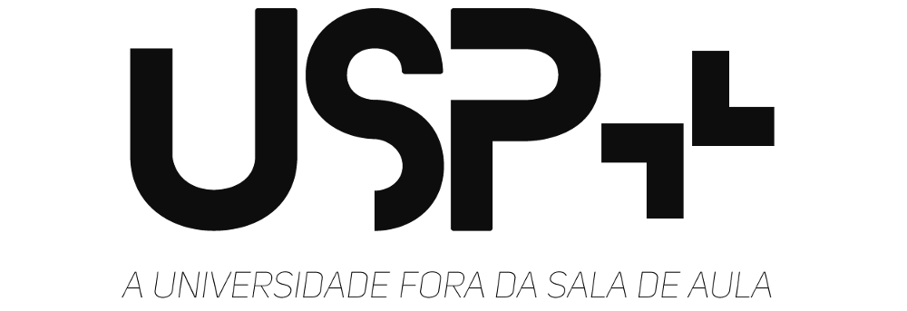

---

Esse projeto esta sendo construido por Daniela Favero, Felipe Noronha e Rodrigo Vidotti como projeto da disciplina MAC0218 - Tecnicas de programação II, do instituto de Matematica e Estatistica da Universidade de São Paulo.

Para acessar a versão online da aplicação hospedada pelo heroku, basta acessar [este link](https://uspmais.herokuapp.com/).

# Como executar localmente

1. `git clone https://github.com/mrfelipenoronha/uspmais.git` - Clona o repositório do github

2. `sudo docker-compose build` - Constrói a imagem do projeto atual

3. `sudo docker-compose up` - Subindo a aplicação

4. Acesse `http://localhost:3000`

5. `sudo docker-compose down` - Para a execução

6. Para execução dos nossos teste, basta abrir o terminal iterativo docker após construiur a imagem do projeto e subir a aplicação, através do comando `sudo docker exec -ti uspmais_web_1 /bin/bash`. No terminal, digite `rspec` para testar os nossos models e controllers, e digite `cucumber` que testará as nossas views.

> Em alguns momentos o docker-compose up não funciona de primeira, sendo necessário que o container seja finalizado e inicializado novamente para o funcionamento correto.

## Próximos passos ?

Hoje, podemos nos dizer satisfeitos com o nosso trabalho, porém ainda não alcançamos o nosso objetivo. Começamos com a ideia de distribuir a nossa aplicação para solucionar um problema que discutimos e encontramos no nosso dia a dia no instituto, e agora cabe a nós apresentarmos e dar esse retorno ao IME, ou até talvez, a USP inteira.

A seguir esta uma lista com as proximas mudanças que faremos na plataforma:

- Tradução de mensagens em erros
- Validação por email da criação de usuario.
- Ligação com Travis-CI
- Uso de API do googleMaps para localização de evento
- Integração com API da google para salvar eventos na agenda.

## Agradecimentos

Gostaríamos de agradecer primeiramente ao professor e monitor da disciplina, que deram a oportunidade e o apoio necessário para que pudéssemos aprender sobre a construção de uma aplicação a partir do zero, bem como a possibilidade de vivenciarmos a metodologia ágil, o trabalho em equipe e a formação de conhecimento através da prática.

Também é importante evidenciar o papel da universidade que nos disponibiliza esse ambiente de aprendizado contínuo, tal como o próprio ambiente físico como o fornecimento de equipamentos para que pudessemos trabalhar e nos reunirmos.

Por fim, temos que agradecer aos vários tutoriais, soluções e pessoas dispostas a nos ajudar, tanto conhecidos como na própria internet, como por exemplo o StackOverFlow.

Muito obrigado.
